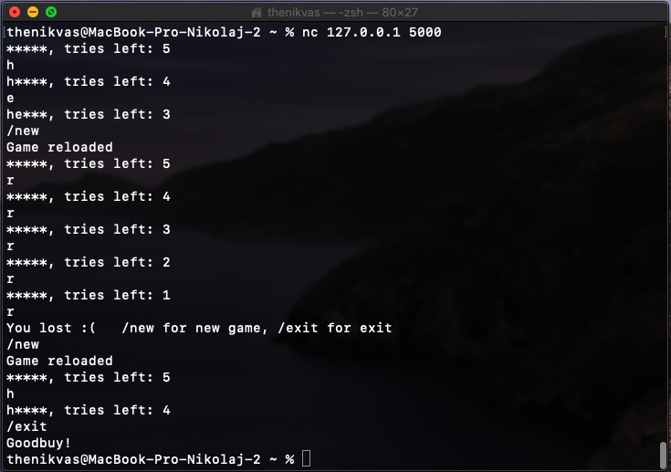

# Поле чудес

## Запуск сервера

```
game 127.0.0.1 5000 hello 5
// [ip] [порт] [слово] [число попыток]
```

## Процесс

Игрок отправялет букву, сервер отсылает ему новое состояние игры

В игре также реализован ряд комманд:
- /new
- /status
- /exit

## Пример



## Технические подробности

Компилировать при помощи clang с cmake

Необходим установленный Boost

Сервер асинхронный, может обслуживать множество игроков одновременно

Было принято решение не писать отдельный клиент, ибо к игре можно подключиться при помощи любого встроенного tcp клиента.

При окончании игры сервер не будет отключать клиента, он будет ждать последующих комманд.

К примеру:

```
nc 127.0.0.1 5000
```

